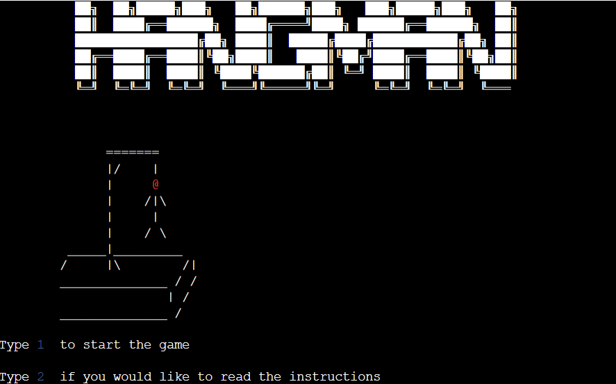
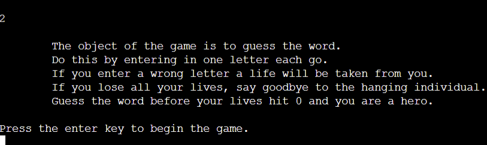
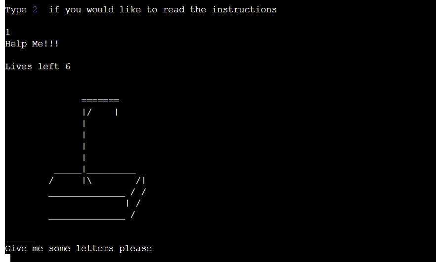
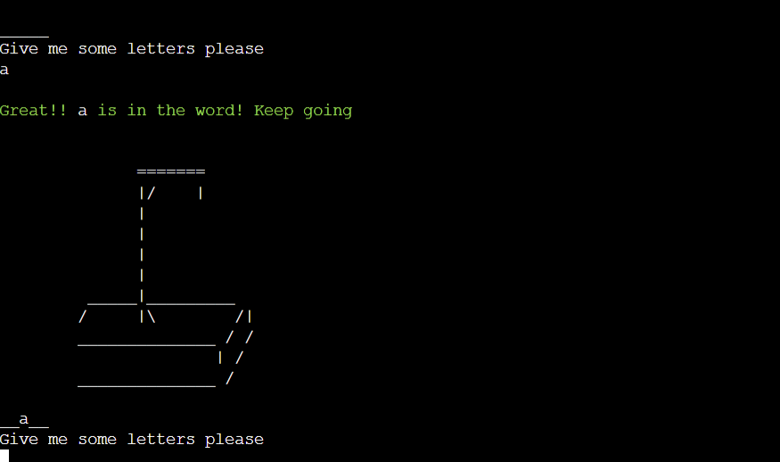
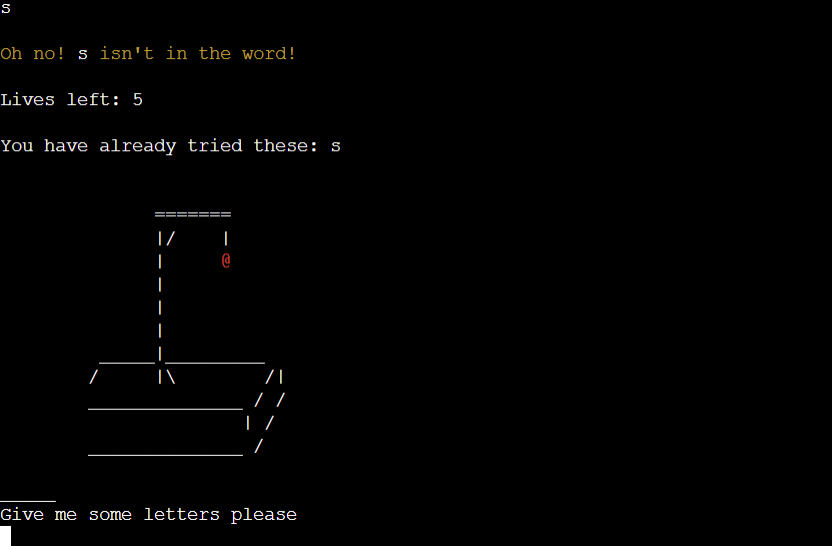
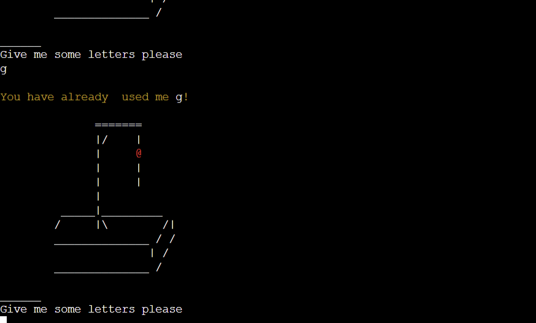
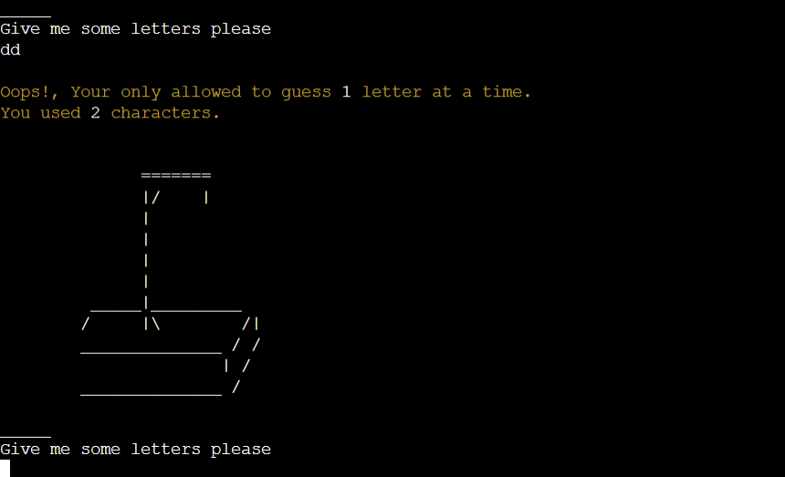
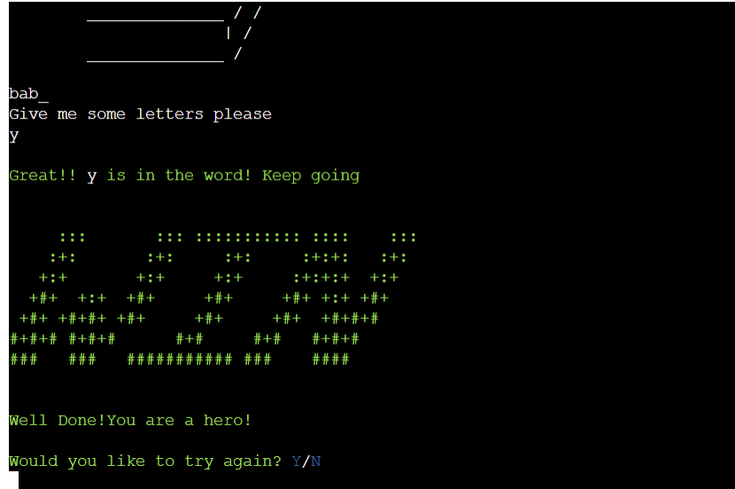
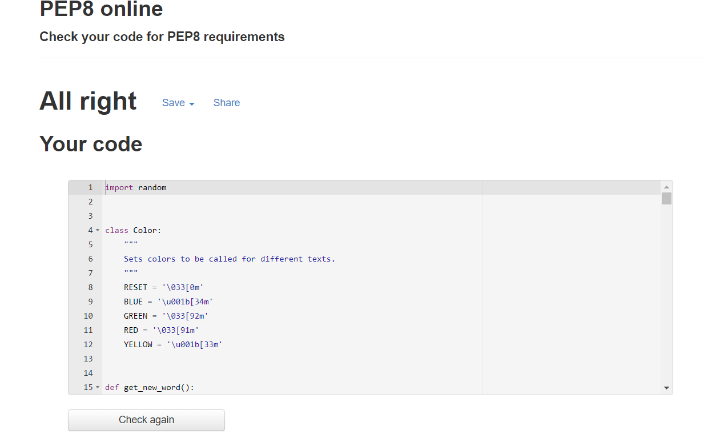

# Hangman 2022 - Hangman Game 

## Introduction 

Hangman 2022 is a classic Hangman game. The object of the game is to guess the hidden word before your lives run out, thus hanging the man/woman. The hidden word is randomly selected from a list of alomost one thousand words. You can play this game anythime and anywhere as you dont need an opposing player in order to play the game. 

The game can be found [**here**](https://hangman-2022.herokuapp.com/)

# Structure 
* The game is run via a mock terminal on a web page. 
* The user is only required to input one character follwed by the Enter Key. 

## Logic Flow

* I created a visual flow chart in order to develop the logic behind the game and ensure each function would work accordingly depending on the users input. 

# User Stories

* As a user, I want a game game that is fun and easy to play. 
* As a user, I want to be able to view the instructions and/or rules of the game.
* As a user, I want to get feedback whether correct or incorrect to help with game progression.
* As a user, I want to be able to replay the game as many times as possible. 

# Developers Objectives 

* Provide a game with valid logic flow and a game that is easy to user.
* Provide a simple user interface.
* Provide a challenging game for the user gto play.

# Features 

## Existing Features 

### Landing page 

* The first things the user sees when entering the game is a visual representation of a the Hangman logo and also an image of the hangman itself. This is eyecatching and fun for the user to see. 
* The user is also presented with two options, to either start the game immediately or view the game instructions. 4

### Instructions 

* If the user decides he or she would like to view the game instructions before beginning, the user must type 2. He or she is then presented with the game instructions. 
* After viewing the game instructions the user just has to hit Enter to continue to the main game. 

### Start Game

* When the user types 1 to start the game, he or she is brought to the main game page. 
* On this page the user is shown an empty hangimng struture, his or her lives, and also a blank worf structure.
* The user is prompted to type in some letters to save the hangman. 

### Correct Guess 

* When the user inputs a correct guess, he or she will be freeted with a green message telling them it was correct.
* No lives will be taken from the user and the hangman structure will remain empty. 

### Wrong Guess 
 
* If the user whilst playing the game enters a wrong guess, the hangman will start to form from the head downwards and the user will ne told in yellow that the guess was incorrect.The head will be coloured red for better UX. 
* The user will also be shown that he or she has lost a life. 
* The user will also be show the letters that have been already guessed to prevent the user from guessing the same letter. 

### Guessed the same letter 

* If the user guesses a letter he or she has already guessed, he or she will be shown a message stating that fact and also what letter the have guessed already. 
* No lives will be taken from the user and the hangman will remain the same. The message is presented in yellow to act as a warning to the user. 

 

### Guessed more than one letter

* If a user enters more than one letter he or she will be presented with a message informing them this is not allowed.The message will be presented in yellow to act as a warning. 
* No lives will be taken from the user and the hangman will remain the same. The message is presented in yellow to act as a warning to the user.

### Guess the correct word 

* If the user guess the correct word before running out of lives then the game is complete. 
* He or she will be greeted with an eyecatching green win message. 
* He will also be asked if he or she would like play again. this is essential for re-playability. If the user selects Y then a new word will be used and the game will start again. If N is selected then the program will finish. 

 

### Run out of lives 

* If the user fails to guess the correct word and runs out of lives, he or she will be presented with a red fail message as the man is essential hung. 
* He will also be asked if he or she would like play again. this is essential for re-playability. If the user selects Y then a new word will be used and the game will start again. If N is selected then the program will finish. 

# Technologies Used 

## Languages 

* Python - Used to create all the games code. 
* HTML - Code Institute template.
* JavaScript - Code Institute template.

# Testing 

## Python Testing 

* Implementation - Python testing was done by running my code through PEP8. 
* Test - To conduct this test i copied my code into the PEP8 tester and pressed check code. 
* Result - A number of errors appeared when testing my code, thes arrors did not affect the funtionality but did not conform to Python testing standards.
* Verdict - With the errors identified, I proceeded to correct all errors and put mu code through the test again. The code then passed with no errors. 

## Input Testing 

* Implementation - I used the Python3 run.py in the terminal to run my code and test invalid inputs. I also used the deployed page to test this also. 
* Test - I continously entered invalid inputs when prompted to enter data. 
* Result - Some invalid input errors accured and were noted as fixed bugs.
* Verdict - After fixing these bugs and errors by changing my code, the test was passed. 

## Functionality Testing

* Implementation - I deployed my site on Heroku to test gameplay functionality. 
* Test - During the course of this test, my family and friends played the game numerous times. i instructed them to try and find arrors in the games functionality and report back their findings.
* Result - After the extensive testing carried out by my peers, no errors were found and only positive feedback was reported. 
* Verdict - Game functionality testing was conducted throughly and the test was passed.

## Testing User Stories

1. As a user, I want a game game that is fun and easy to play.

* The basic UX and functionality of this game made it very simple to use and suit able for all ages.
* The simple key only input method meant it was etremely easy the go through the game with minimal effort and the game play was smooth at every point.

2.  As a user, I want to be able to view the instructions and/or rules of the game.

* Upon entering the site, an option to view the instructions was clearly visible. 
* The instructions were clear and concise and made it clear what the rules of the game are. 

3.  As a user, I want to get feedback whether correct or incorrect to help with game progression.
* A key feature was that whenever an incorrect letter was used, a warning would appear and a visible representation was clear to see. 
* This was also the case with correct answers and also when i completed the game or failed to do so, a visual representation saying Win or Fail was shown. 

4.  As a user, I want to be able to replay the game as many times as possible. 
* This feature was essential to the replayability of the game, a lot of times whilst playing, the word was not correctly guessed and the lives ran out. 
* So having the otion to start agin proved throughly enjoyable and a key feature. 

# Bugs 

* Bug - Hangman structure was not visible when correct or incorrect inputs entered.
  * Fix - Print(hangman_construction{lives}) needed to be placed inside the while loop for this function to work. 

* Bug - When asked to Play Again and the N key was entered, the user was taken back to the main page instead of the program ending.
   * Fix - exit() was used to end the program. 

* Bug -  Game was on a continous loop and went into minus lives.
   * Fix - Lives > 0 needed to ne added to the while loop so the fail sign shows when lives reach 0. 

* Bugs - User input was showing as incorrect even when letter was in the hidden word.
   * Fix - User input needed to be convert using .upper so that the input would be considered valid. 

# Deployment 

Deploying
1. Push your code to GitHub.
2. Log in or Sign up to Heroku where you need to create a new app.
3. Select a unique name.
4. In the settings tab reveal the config vars, for this project one had to be added as per Code Institute's guidance.
5. For KEY, input PORT and for VALUE, input 8000 and click add.
6. Below that, click add buildpack, select Python and save.
7. Click add buildpack again, now select Nodejs and save.
8. Python should be above Nodejs on the buildpacks list.
9. Go to deploy tab and for deployment method select GitHub and connect your GitHub account.
10. When prompted enter the repository you want to deploy, search and once found connect it.
11. Now you can either set it to automatically or manually deploy the appropriate branch.
* Automatically will deploy the app everytime you push something to GitHub.
* Manually you have control over when the app should be deployed, but you have to remember to do it.
12. Heroku will have a link to the live web page.

