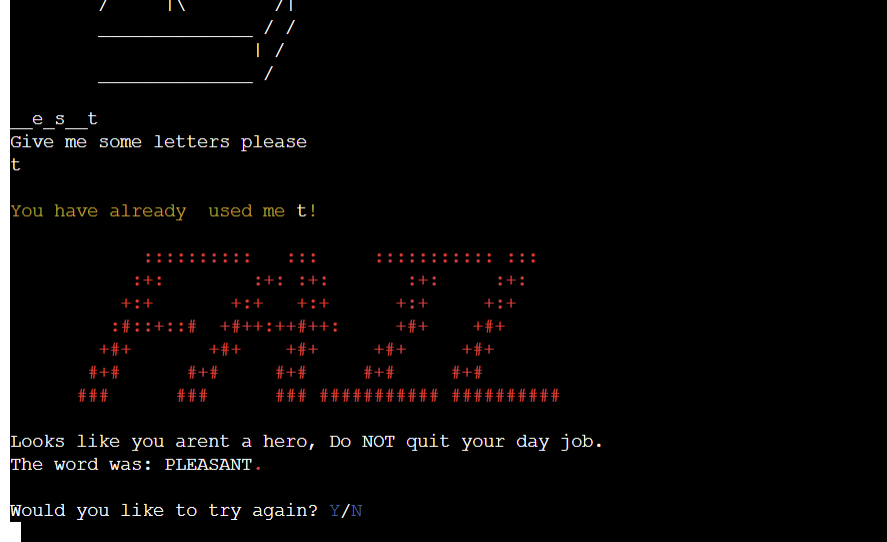

# Hangman 2022 - Hangman Game 

## Introduction 

Hangman 2022 is a classic Hangman game. The object of the game is to guess the hidden word before your lives run out, thus hanging the man/woman. The hidden word is randomly selected from a list of alomost one thousand words. You can play this game anythime and anywhere as you dont need an opposing player in order to play the game. 

The game can be found [**here**](https://hangman-2022.herokuapp.com/)

# Structure 
* The game is run via a mock terminal on a web page. 
* The user is only required to input one character follwed by the Enter Key. 

## Logic Flow

* I created a visual flow chart in order to develop the logic behind the game and ensure each function would work accordingly depending on the users input. 

# User Stories

* As a user, I want a game game that is fun and easy to play. 
* As a user, I want to be able to view the instructions and/or rules of the game.
* As a user, I want to get feedback whether correct or incorrect to help with game progression.
* As a user, I want to be able to replay the game as many times as possible. 

# Developers Objectives 

* Provide a game with valid logic flow and a game that is easy to user.
* Provide a simple user interface.
* Provide a challenging game for the user gto play.

# Features 

## Existing Features 

### Landing page 

* The first things the user sees when entering the game is a visual representation of a the Hangman logo and also an image of the hangman itself. This is eyecatching and fun for the user to see. 
* The user is also presented with two options, to either start the game immediately or view the game instructions. 4

### Instructions 

* If the user decides he or she would like to view the game instructions before beginning, the user must type 2. He or she is then presented with the game instructions. 
* After viewing the game instructions the user just has to hit Enter to continue to the main game. 

### Start Game

* When the user types 1 to start the game, he or she is brought to the main game page. 
* On this page the user is shown an empty hangimng struture, his or her lives, and also a blank worf structure.
* The user is prompted to type in some letters to save the hangman. 

### Correct Guess 

* When the user inputs a correct guess, he or she will be freeted with a green message telling them it was correct.
* No lives will be taken from the user and the hangman structure will remain empty. 

### Wrong Guess 
 
* If the user whilst playing the game enters a wrong guess, the hangman will start to form from the head downwards and the user will ne told in yellow that the guess was incorrect.The head will be coloured red for better UX. 
* The user will also be shown that he or she has lost a life. 
* The user will also be show the letters that have been already guessed to prevent the user from guessing the same letter. 

### Guessed the same letter 

* If the user guesses a letter he or she has already guessed, he or she will be shown a message stating that fact and also what letter the have guessed already. 
* No lives will be taken from the user and the hangman will remain the same. The message is presented in yellow to act as a warning to the user. 

 

### Guessed more than one letter

* If a user enters more than one letter he or she will be presented with a message informing them this is not allowed.The message will be presented in yellow to act as a warning. 
* No lives will be taken from the user and the hangman will remain the same. The message is presented in yellow to act as a warning to the user.

### Guess the correct word 

* If the user guess the correct word before running out of lives then the game is complete. 
* He or she will be greeted with an eyecatching green win message. 
* He will also be asked if he or she would like play again. this is essential for re-playability. If the user selects Y then a new word will be used and the game will start again. If N is selected then the program will finish. 

 

### Run out of lives 

* If the user fails to guess the correct word and runs out of lives, he or she will be presented with a red fail message as the man is essential hung. 
* He will also be asked if he or she would like play again. this is essential for re-playability. If the user selects Y then a new word will be used and the game will start again. If N is selected then the program will finish. 

# Technologies Used 

## Languages 

* Python - Used to create all the games code. 
* HTML - Code Institute template.
* JavaScript - Code Institute template.

# Testing 

